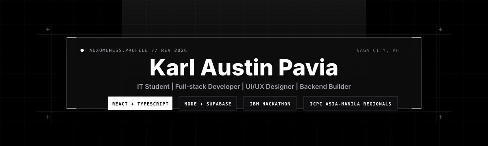
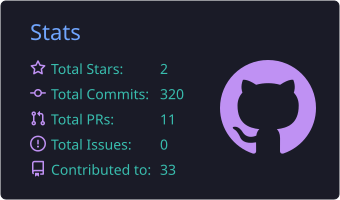
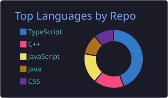
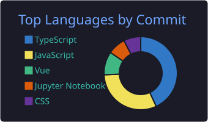

<div align="center">

  

  <a href="https://git.io/typing-svg">
    
  </a>

  <p>
    <a href="https://github.com/auxomeness?tab=followers">
      
    </a>
    
    
  </p>

</div>

<p align="center">
  
  
  
</p>

### About me

```ts
const austin = {
  username: "auxomeness",
  location: "Naga City, Philippines",
  education: "BS Information Technology, Ateneo de Naga University",
  role: "IT student, full-stack developer, and graphic artist",
  focus: ["web apps", "mobile apps", "backend systems", "UI/UX", "technical support"],
  currentMode: "building polished student productivity, finance, and ordering systems",
  principle: "disciplined execution, clean interfaces, reliable systems",
};
```

### Tech stack

<div align="center">

  

</div>

### Trophies

<div align="center">

  

</div>

### What I build

<table>
  <tr>
    <td width="50%">
      <h3>Full-stack apps</h3>
      <p>Student productivity tools, expense tracking systems, ordering platforms, and practical client-server applications.</p>
    </td>
    <td width="50%">
      <h3>UI/UX and graphics</h3>
      <p>Premium interfaces, publication layouts, visual identity systems, and campaign materials with consistent brand direction.</p>
    </td>
  </tr>
  <tr>
    <td width="50%">
      <h3>Backend systems</h3>
      <p>APIs, database-backed workflows, secure data handling, transaction logic, alerts, and scalable app architecture.</p>
    </td>
    <td width="50%">
      <h3>Technical support</h3>
      <p>Hardware and software troubleshooting, computer setup, system maintenance, digital workflows, and customer support.</p>
    </td>
  </tr>
</table>

### GitHub activity

<div align="center">

  
  
  

  <br />
  <br />

  

</div>

### Contribution playground

<div align="center">

  <picture>
    <source media="(prefers-color-scheme: dark)" srcset="https://raw.githubusercontent.com/auxomeness/auxomeness/output/github-contribution-grid-snake-dark.svg" />
    <source media="(prefers-color-scheme: light)" srcset="https://raw.githubusercontent.com/auxomeness/auxomeness/output/github-contribution-grid-snake.svg" />
    
  </picture>

</div>

### Featured projects

| Project | What it does | Highlights |
| --- | --- | --- |
| **[CodeGuard AI](https://github.com/AT512-dev/Team-AVON-Project-for-IBM-Hackathon)** | Team AVON project for the IBM Bob Hackathon 2026 | Team architect for backend development and security research; deterministic static analysis, OWASP vulnerability detection, cross-file data-flow tracking, IBM WatsonX-powered remediation |
| **LUMEN** | Full-stack student productivity application | Smart scheduling, calendar integration, task management, workload analytics, premium UI/UX |
| **EXPY** | Expense tracking application | Client-server architecture, transaction management, categories, threshold alerts, financial insights |
| **APoS** | Web and mobile pre-order system | Mobile-first ordering flow, real-time interaction, modern UI/UX, responsive performance |

### Highlights

```txt
ICPC Asia-Manila Regionals 2025 competitor
Team AVON architect for the IBM Bob Hackathon 2026
Backend development and security research for CodeGuard AI
```

### Connect

<div align="center">

  <a href="https://github.com/auxomeness">
    
  </a>
  <a href="mailto:karlaustinpavia17@gmail.com">
    
  </a>
  <a href="https://www.facebook.com/karlaustin.pavia">
    
  </a>
  <a href="https://www.linkedin.com/in/karl-austin-pavia-032814324">
    
  </a>
  <a href="https://www.instagram.com/thatguyaustinn/">
    
  </a>

</div>

<p align="center">
  <sub>Building polished products, reliable systems, and security-aware software.</sub>
</p>
